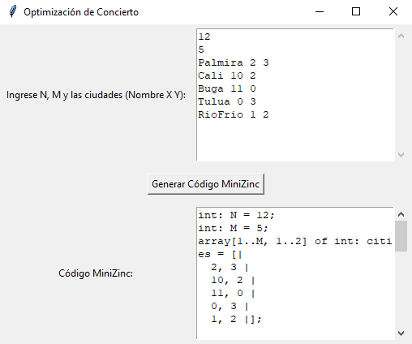
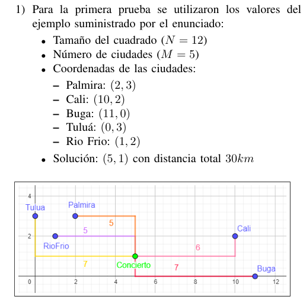

# Optimización de la Ubicación de un Concierto

Este proyecto tiene como objetivo determinar la ubicación óptima para un concierto en el Valle del Cauca, minimizando el desplazamiento total desde diversas ciudades. Se utiliza la distancia Manhattan para medir las distancias entre el concierto y las ciudades, garantizando que el punto elegido no favorezca a una ciudad en particular.

## Descripción del Proyecto

El problema se modela en un plano cuadrado de N x N km donde se ubican M ciudades, cada una en una coordenada (X, Y). El objetivo es encontrar un punto para el concierto que minimice la suma total de las distancias Manhattan entre el concierto y todas las ciudades, con las siguientes restricciones:

- El concierto no puede estar ubicado en una ciudad.
- La diferencia en la distancia al concierto entre la ciudad más cercana y la más lejana no puede ser mayor a 2 km.

## Implementación

El proyecto está dividido en dos partes principales:

1. **Interfaz Gráfica en Python**:
   - Utiliza la biblioteca `tkinter` para una GUI donde el usuario puede ingresar el tamaño del cuadrado, el número de ciudades, y sus coordenadas.
   - Un botón genera el código en MiniZinc que modela el problema de optimización con las restricciones mencionadas.
2. **Código en MiniZinc**:
   - El código generado es ejecutable en MiniZinc para resolver el problema de optimización y obtener la ubicación óptima del concierto.

## Estructura del Proyecto

- `proyecto.py`: Código fuente en Python que genera el modelo de MiniZinc.
- `Enunciado.pdf`: Descripción detallada del problema y requisitos.
- `Informe.pdf`: Informe técnico que describe la solución, implementación y análisis de las pruebas realizadas.

## Requisitos

- Python
- Bibliotecas: `tkinter`
- MiniZinc

## Ejecución

1. Ejecuta el archivo `proyecto.py`:
   ```bash
   python proyecto.py
   ```
2. Ingresa los datos requeridos en la interfaz:
   - Tamaño del cuadrado (N)
   - Número de ciudades (M)
   - Nombre y coordenadas de las ciudades en el formato `Nombre X Y`
3. Presiona el botón **Generar Código MiniZinc** para obtener el código que resuelve el problema en MiniZinc.

## Interfaz



## Ejemplo de Entrada

```plaintext
12
5
Palmira 2 3
Cali 10 2
Buga 11 0
Tulua 0 3
RioFrio 1 2
```

## Resultados

La solución generada por MiniZinc minimiza la distancia total y asegura que ninguna ciudad esté favorecida más de 2 km en comparación con las demás.


